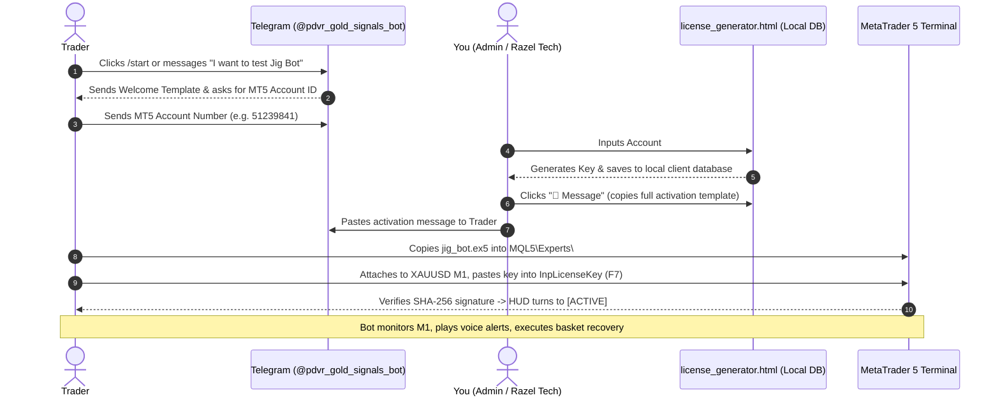

# Jig Bot — Complete License Distribution & Operations Manual
### Powered by Razel Tech | Version v1.00
**Official Ecosystem: Telegram Bot (`@pdvr_gold_signals_bot`) • Channel (`t.me/PDVR_gold_signals`) • Offline Client Database (`license_generator.html`)**

---

## 1. Executive Overview & Distribution Philosophy

This document details the **exact, pin-to-pin operational workflow** for distributing **Jig Bot v1** to traders while guaranteeing **zero intellectual property leakage**, **strict account security**, and **seamless customer onboarding**.

### Core Architecture Principles:
1. **Zero Source Code Exposure**:
   - Traders **never** receive `jig_bot.mq5`.
   - Traders only receive the pre-compiled binary [`jig_bot.ex5`](file:///d:/webapps/jiguruginganiabot_website/jig_bot.ex5) and the 13-track voice audio suite.
2. **Hardware-Level Account Binding**:
   - Every license key is cryptographically signed using **SHA-256** with an internal developer salt (`RAZEL_TECH_JIG_SECRET_SALT_2026_PDVR`).
   - The key encodes the exact **MT5 Account Login ID**, **License Tier** (`DEMO` vs `LIVE`), and **Expiration Date** (`YYYYMMDD`).
   - A key issued for account `#51239841` **cannot be run** on any other account number. Account sharing is mathematically impossible.
3. **Hardware Account Mode Isolation**:
   - A `DEMO` key will **only** execute on accounts where `ACCOUNT_TRADE_MODE == ACCOUNT_TRADE_MODE_DEMO`.
   - If a trader attempts to enter a Demo key on a real funded live account, the internal License Guard immediately triggers `[LOCKED]` mode and blocks order execution.
4. **100% Private Offline Database**:
   - You do not need expensive backend servers, SQL hosting, or cloud authentication APIs.
   - [`license_generator.html`](file:///d:/webapps/jiguruginganiabot_website/license_generator.html) runs entirely inside your browser, persists records in `localStorage`, and allows 1-click **Export to CSV** for Microsoft Excel and Google Sheets.

---

## 2. Official Brand Assets & Telegram Identifiers

| Asset / Channel | Official Value | Usage in Distribution |
| :--- | :--- | :--- |
| **Product Name** | **Jig Bot** | Official EA name on chart HUD and website. |
| **Engineering Attribution** | **Powered by Razel Tech** | Technical copyright and licensing provider. |
| **Current Release** | **v1** (or v1.00) | Current forward-testing production release. |
| **Bot Icon** | `app_icon.png` (1024x1024) | Set as your Telegram Bot avatar for `@pdvr_gold_signals_bot` and website visual. |
| **Telegram Key Bot** | [`@pdvr_gold_signals_bot`](https://t.me/pdvr_gold_signals_bot) | Where traders request trial keys and submit their MT5 Account IDs. |
| **Telegram Public Channel** | [`https://t.me/PDVR_gold_signals`](https://t.me/PDVR_gold_signals) | Where you broadcast Gold signals, forward-testing updates, and EA releases. |
| **Target Instrument** | **XAUUSD (Gold)** | Sole supported symbol. |
| **Timeframe** | **M1 (1-Minute)** | Sole supported timeframe. |

---

## 3. End-to-End Pin-to-Pin Distribution Workflow

Here is the exact step-by-step lifecycle from a trader discovering your bot to running live trades on MetaTrader 5:



---

### Step 1: Lead Capture & Welcome Greeting (Telegram)

When a trader discovers your Telegram channel or website, they open [`@pdvr_gold_signals_bot`](https://t.me/pdvr_gold_signals_bot).

**Send this Welcome Template:**
```text
👋 Welcome to the Official Jig Bot Ecosystem!
Powered by Razel Tech | High-Frequency XAUUSD M1 Adaptive Engine

Jig Bot is an institutional MetaTrader 5 automated trading system engineered specifically for Gold (XAUUSD) on the 1-Minute chart.

🎁 We offer a Free 3, 5, or 7-Day Demo Trial so you can forward-test the 10-level recovery grid and 13-track voice audio suite on your own demo account with zero financial risk.

To get your custom activation key:
1. Open MetaTrader 5.
2. Create or login to any MT5 DEMO account (recommended: IC Markets, Exness, RoboForex, or Tickmill).
3. Send us your MT5 Account Number (Login ID).

Example reply:
"Account Number: 51239841"

Once received, we will generate your cryptographically signed trial license key!
```

---

### Step 2: Generating the License Key in `license_generator.html`

Once the trader replies with their MT5 account number:

1. Double-click to open [`license_generator.html`](file:///d:/webapps/jiguruginganiabot_website/license_generator.html) in your web browser (Google Chrome, Microsoft Edge, or Firefox).
2. Fill out the simple form:
   - **MT5 Account Number**: Enter the trader's exact login ID (e.g. `51239841`). *(Only digits allowed).*
   - **Trader Name / Note**: Enter their name or Telegram handle (e.g. `@trader_mike` or `John D. - Demo 7D`).
   - **License Tier**:
     - Select **Demo Trial (`JIG-DEMO-...`)** for testing accounts.
     - Select **Live Pro (`JIG-LIVE-...`)** for paying real-money clients.
   - **Access Duration**:
     - For Demo: Click **3 Days**, **5 Days**, or **7 Days** (or pick a custom calendar date).
     - For Live: Click **30 Days (1 Month)**.
3. Click the golden **"Generate License Key"** button.

#### What happens instantly:
- The SHA-256 cryptographic signature is computed.
- The formatted key appears:
  ```
  JIG-DEMO-51239841-20260918-3F8E1B9A
  ```
- The record is automatically saved into your private browser database.
- A summary card appears with buttons: **"Copy Key"** and **"Copy Full Trader Activation Message"**.

---

### Step 3: Sending the Delivery Template to the Trader

Click the **"💬 Message"** button next to the trader's record in `license_generator.html` (or copy the pre-formatted template below):

**Delivery Template:**
```text
👋 Hello @trader_mike! Here is your official activation key for Jig Bot v1:

🔑 License Key:
JIG-DEMO-51239841-20260918-3F8E1B9A

📋 License Details:
• Authorized Account: #51239841
• License Tier: DEMO (Free Trial)
• Access Duration: 7 Days Remaining (Valid until 2026-09-18)
• Target Instrument: XAUUSD (Gold)
• Chart Timeframe: M1 (1-Minute)

⚙️ Fast 3-Minute Setup Guide:
1. Download jig_bot.ex5 and the audio sounds from:
   https://t.me/PDVR_gold_signals (or your official website)
2. In MetaTrader 5, click: File -> Open Data Folder.
3. Place jig_bot.ex5 inside MQL5\Experts\
4. Place the voice .wav files inside Sounds\
5. Restart MT5 or right-click Navigator -> Refresh.
6. Open an XAUUSD M1 chart. Drag Jig Bot onto the chart.
7. In the Inputs tab (F7), paste your key into InpLicenseKey.
8. Make sure "Allow Algo Trading" is enabled at the top of MT5!

✅ Your on-chart dashboard will immediately change to [ACTIVE] (7 Days Left) and start monitoring price action!

Need support? We are right here at @pdvr_gold_signals_bot.
```

---

### Step 4: What the Trader Experiences in MetaTrader 5

#### Case A: Key Not Entered or Wrong Key
If the trader opens the chart without entering the key, or enters an invalid key:
- An audible alert plays (`Timeout.wav`).
- The live chart HUD displays a red security card:
  ```text
  =====================================================
    JIG BOT  v1  [LOCKED]
    Powered by Razel Tech
  =====================================================
    License Status: LICENSE KEY MISSING OR UNREGISTERED
    Active Account: #51239841 (DEMO)
    Issue Details:  Please enter a valid key in Inputs (F7)
  -----------------------------------------------------
    ACTIVATION INSTRUCTIONS:
    1. Copy your MT5 Account ID: 51239841
    2. Request your Activation Key:
       - Telegram Bot: @pdvr_gold_signals_bot
       - Channel: t.me/PDVR_gold_signals
       - Support: Powered by Razel Tech
    3. Open Bot Inputs (F7) -> Paste into InpLicenseKey
  =====================================================
  ```
- **Zero orders can open**. The trading engine remains completely frozen.

#### Case B: Valid Key Entered
As soon as the trader inputs `JIG-DEMO-51239841-20260918-3F8E1B9A`:
- The HUD immediately updates to:
  ```text
  =====================================================
    JIG BOT  v1  [ACTIVE]
    Powered by Razel Tech
  =====================================================
    License Tier:   DEMO PRO (7 Days Left)
    Account:        #51239841 (DEMO - LICENSED)
    Spread Status:  14 / Max 50 pts (OK)
    Audio Alerts:   ENABLED
  -----------------------------------------------------
    No Active Basket (Scanning M1 Candlesticks)
  =====================================================
  ```
- When market volatility triggers an initial trade, `entry placed.wav` announces the trade.
- If market retraces, the 10-level cluster grid activates with respective `level 1.wav` ... `level 10.wav` alerts.
- When the dynamic VWAP basket hits target profit, all trades close simultaneously and `tp hit.wav` plays.

---

### Step 5: Trial Expiration & Upgrading to Live 1-Month Pro

On the expiration date (e.g. 2026-09-18 at 23:59 broker server time):
- The bot checks `TimeTradeServer() >= expiry_datetime`.
- The HUD immediately displays:
  ```text
  =====================================================
    JIG BOT  v1  [LOCKED]
    Powered by Razel Tech
  =====================================================
    License Status: DEMO LICENSE EXPIRED on 2026.09.18
    Active Account: #51239841 (DEMO)
    Issue Details:  Access period has ended. Contact Razel Tech to renew.
  ```
- Any currently open positions remain managed or can be manually closed; no new trades will open.

#### Re-engagement & Upgrade Message Template:
Send this message to the trader in Telegram:
```text
👋 Hi @trader_mike!

Your 7-Day Demo Trial for Jig Bot v1 has officially completed. 

We hope you experienced firsthand the power of our adaptive cluster recovery and dynamic VWAP liquidation on Gold M1!

🚀 Ready to trade real capital?
You can now upgrade to our 1-Month Live Account Pro Access:
• Valid for 30 days of real-money trading on your funded MT5 account.
• Full automated execution with the -$1500 drawdown circuit breaker.
• Priority developer support and direct updates.

To upgrade:
1. Provide your Live MT5 Account Number.
2. Once activated, we will issue your JIG-LIVE key.

Contact us here at @pdvr_gold_signals_bot to secure your live license!
```

---

## 4. Managing Your Client Database in `license_generator.html`

The generator is not just a key tool — it is a **complete client management system**:

### 1. Real-Time Search & Filtering:
- **Search Bar**: Type any account number (e.g. `51239841`), trader name (`Mike`), or part of a key to locate records instantly.
- **Filter Tabs**:
  - `All`: View total issued licenses.
  - `Active`: Show only currently valid licenses.
  - `Expired`: Show clients whose trials have ended (perfect for follow-ups!).
  - `Demo`: Show all demo trial users.
  - `Live`: Show all paying real-money clients.

### 2. Export to CSV (Excel / Google Sheets):
- Click **"📥 Export to CSV / Excel"** at the top right of the table.
- Instantly downloads `jig_bot_licenses_YYYY-MM-DD.csv`.
- Columns included: `Account Number`, `Trader Name / Note`, `Tier`, `Duration`, `Created Date`, `Expiry Date`, `Status`, `License Key`.
- Open directly in Excel to track your customer base, renewals, and revenue.

### 3. Backup & Restore (JSON):
- Click **"💾 Backup JSON"** to download a complete backup file `jig_bot_database_backup_YYYY-MM-DD.json`.
- When switching computers, open `license_generator.html` on the new machine and click **"📂 Restore JSON"** to import all past trader records with zero data loss.

---

## 5. Alternative CLI Key Generation (`jigbot.exe`)

If you prefer working inside a terminal without opening a browser:

```cmd
.\jigbot.exe key <ACCOUNT_ID> <TIER> <DAYS> [NAME]
```

### Examples:
- **7-Day Demo Key**:
  ```cmd
  .\jigbot.exe key 51239841 DEMO 7 "Mike Telegram"
  ```
- **30-Day Live Key**:
  ```cmd
  .\jigbot.exe key 88129304 LIVE 30 "John Funded Live"
  ```

The CLI prints out the exact key and the formatted Telegram message ready to copy and paste!

---

## 6. Security Architecture & Anti-Piracy Verification

| Threat | How Jig Bot Neutralizes It |
| :--- | :--- |
| **Trader tries to decompile `.ex5` to steal code** | `.mq5` is never sent to traders and only exists in your private GitHub repo (`jigbot-code`). MetaTrader 5 `.ex5` files are strictly compiled machine bytecode that cannot be reversed into clean source code. |
| **Trader shares key with a friend** | The key is mathematically signed with their MT5 Account ID (`AccountInfoInteger(ACCOUNT_LOGIN)`). If their friend enters it on account `#99999999`, the signature check fails and the bot locks. |
| **Trader edits `DEMO` to `LIVE` in the key text** | Changing a single character changes the required SHA-256 hash. The signature verification fails immediately. |
| **Trader modifies computer clock** | Jig Bot checks `TimeTradeServer()` (the broker's atomic clock) rather than local computer time. Local clock manipulation has zero effect. |
| **Trader attempts to run Demo key on Live account** | `ACCOUNT_TRADE_MODE` check strictly verifies `ACCOUNT_TRADE_MODE_DEMO`. Live accounts reject demo keys automatically. |
| **Trader tries to run EA in Strategy Tester** | Strategy Tester is hard-disabled in `OnInit()` with `MQLInfoInteger(MQL_TESTER)`. Live forward charts only. |
